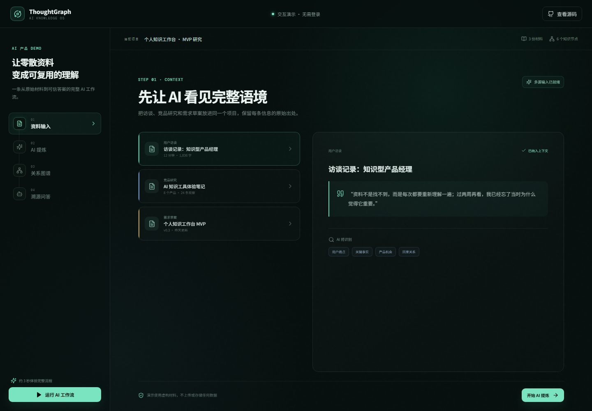

# ThoughtGraph

> 把零散资料转化为可追溯、可连接、可对话的产品知识。

[在线体验 AI Demo](https://xyk-865.github.io/ThoughtGraph/) · [直接打开独立 Demo 页](https://xyk-865.github.io/ThoughtGraph/demo.html)



ThoughtGraph 是一个面向知识工作者的 AI 知识理解工作台。它不止保存资料，而是把原始材料、AI 洞察、知识关系和回答证据连接成一条可复用的认知链路。

## 为什么做这个产品

传统知识库解决了“资料放在哪里”，但没有解决“我当时为什么认为它重要”。当用户再次需要这些信息时，真正昂贵的不是搜索，而是重新阅读、重新理解和重新建立上下文。

ThoughtGraph 希望验证一个产品假设：如果 AI 能保留结论与原始证据之间的关系，并把分散的理解连接成图谱，知识复用会不会更快、更可信？

## Demo 展示什么

无需登录，约 3 分钟可以体验完整闭环：

1. **资料输入**：把用户访谈、竞品研究和需求草案放进同一个项目语境。
2. **AI 提炼**：跨材料识别用户痛点、设计原则和产品机会，并展示置信度。
3. **关系图谱**：把洞察组织成可交互的因果、支撑与目标关系。
4. **溯源问答**：基于项目知识回答业务问题，每个关键判断都能回到原始证据。

静态 Demo 使用预设数据，目的是稳定展示产品逻辑，不伪装成实时模型输出。仓库中的完整产品版本使用 Base44 实体、后端函数和 LLM 集成完成真实的数据处理与问答。

## 产品设计取舍

- **信任优先于“像人”**：AI 结论默认附带引用，让用户能校验和修正。
- **结构优先于堆功能**：围绕“输入 → 理解 → 连接 → 使用”构建单一主链路。
- **人保留最终判断**：原文事实、AI 归纳和用户判断在产品中有清晰边界。
- **Demo 零门槛**：招聘评审页不需要账号、API Key 或后端服务。

## 技术架构

```text
React + Vite
├── Portfolio Demo       静态预设数据 / GitHub Pages
├── Base44 SDK           认证、实体存储、文件上传
├── Backend Functions    内容提炼、图谱构建、上下文问答
└── Three.js             3D 知识宇宙可视化
```

核心数据模型包括 `Project`、`Source`、`KnowledgeAsset`、`GraphNode` 和 `GraphEdge`。完整版本的问答函数会按模式召回项目资料或历史知识，并返回带来源引用的答案。

## 本地运行

```bash
npm install
npm run dev
```

- 完整产品：打开终端给出的根地址，需要配置 Base44 环境。
- 招聘 Demo：打开 `/demo.html`，不需要 Base44 或 API Key。

生产构建：

```bash
npm run build
```

GitHub Pages 构建：

```bash
npm run build:github
```

首次发布前，在仓库 **Settings → Pages → Build and deployment** 中把 Source 设为 **GitHub Actions**。之后每次推送到 `main`，[发布工作流](./.github/workflows/deploy-demo.yml) 都会自动构建并更新作品 Demo。

## 下一步验证

- 用“完成一次信息复用所需时间”验证效率价值。
- 用引用打开率、答案修正率衡量信任与质量。
- 用跨周复用历史知识的用户占比衡量长期留存。

---

Built as an AI product case study: grounded synthesis, knowledge graph, and evidence-backed Q&A.
